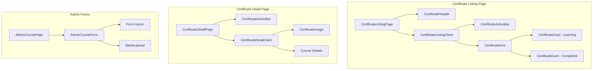

# Certificate Management System - Design Document

## Overview

The Certificate Management System is a standalone feature for displaying learning progress and completed certificates on a dedicated `/certificate` page. The system unifies Learning Progress and Certificates as a single entity (Course) differentiated by completion status and certificate image presence.

### Key Design Decisions

1. **Unified Course Model**: Learning progress and certificates share the same data model, differentiated only by `progress` percentage and `certificate_image` presence. This simplifies the data model and reduces code complexity.

2. **Secret-Based Admin Authentication**: Reuses the existing pattern from project management where admin access is granted via a query parameter matching an environment variable. No separate authentication system needed.

3. **Soft Delete Pattern**: Implements soft delete using a `deleted_at` timestamp, consistent with data recovery best practices.

4. **Editorial Design System**: Matches the existing portfolio's editorial magazine style with coral accents, editorial fonts, and Framer Motion animations.

---

## Architecture

### High-Level Architecture

```mermaid
graph TB
    subgraph Client
        CLP[Certificate Listing Page<br/>/certificate]
        CDP[Certificate Detail Page<br/>/certificate/[slug]]
        ACF[Admin Course Form<br/>/admin/certificate/new]
        AEF[Admin Edit Form<br/>/admin/certificate/[id]/edit]
    end

    subgraph API Layer
        GET_ALL[GET /api/certificates]
        GET_ONE[GET /api/certificates/[slug]]
        POST[POST /api/certificates]
        PUT[PUT /api/certificates/[id]]
        DELETE[DELETE /api/certificates/[id]]
    end

    subgraph Data Layer
        PRISMA[Prisma Client]
        DB[(PostgreSQL)]
    end

    CLP --> GET_ALL
    CDP --> GET_ONE
    ACF --> POST
    AEF --> PUT
    AEF --> DELETE

    GET_ALL --> PRISMA
    GET_ONE --> PRISMA
    POST --> PRISMA
    PUT --> PRISMA
    DELETE --> PRISMA

    PRISMA --> DB
```

### File Structure

```
features/
├── certificates/
│   ├── components/
│   │   ├── CertificateCard.tsx          # Course card for listing
│   │   ├── CertificateGrid.tsx          # Responsive grid layout
│   │   ├── CertificateHeader.tsx        # Page header with labels
│   │   ├── CertificateListingClient.tsx # Client component with animations
│   │   ├── CertificateDetailClient.tsx  # Detail page client component
│   │   ├── CertificateImage.tsx         # Certificate image display
│   │   ├── CourseProgressBar.tsx        # Progress indicator (0-100%)
│   │   ├── CertificateActionBar.tsx     # Admin action bar
│   │   └── CertificateDeleteModal.tsx   # Delete confirmation modal
│   ├── hooks/
│   │   └── useCertificateForm.ts        # Form state management
│   ├── services/
│   │   └── slugify.ts                   # Slug generation from name
│   ├── utils/
│   │   └── validation.ts                # Input validation
│   ├── types.ts                         # TypeScript types
│   └── index.ts                         # Feature exports

app/
├── certificate/
│   ├── page.tsx                         # Certificate listing page
│   └── [slug]/
│       └── page.tsx                     # Certificate detail page
├── admin/
│   └── certificate/
│       ├── new/
│       │   └── page.tsx                 # Course creation form
│       └── [id]/
│           └── edit/
│               └── page.tsx             # Course edit form
└── api/
    └── certificates/
        ├── route.ts                     # GET all, POST
        └── [id]/
            └── route.ts                 # GET one, PUT, DELETE

lib/
└── supabase/
    └── queries/
        └── certificates.ts              # Database queries
```

---

## Components and Interfaces

### Component Hierarchy



### Component Interfaces

#### CertificateCard

```typescript
interface CertificateCardProps {
  course: Course
  index: number
  total: number
  secret?: string
  isAdmin: boolean
}
```

#### CertificateGrid

```typescript
interface CertificateGridProps {
  courses: Course[]
  title: string
  label: string
  emptyMessage: string
  secret?: string
  isAdmin: boolean
}
```

#### CertificateActionBar

```typescript
interface CertificateActionBarProps {
  courseId?: string
  secret: string
  mode: 'listing' | 'detail'
}
```

#### AdminCourseForm

```typescript
interface AdminCourseFormProps {
  secret: string
  course?: Course
  formId?: string
}
```

#### CertificateDeleteModal

```typescript
interface CertificateDeleteModalProps {
  isOpen: boolean
  courseName: string
  onConfirm: () => void
  onCancel: () => void
  isDeleting: boolean
}
```

---

## Data Models

### Prisma Schema Addition

```prisma
// Add to existing schema.prisma

model Course {
  id               String   @id @default(dbgenerated("gen_random_uuid()::text"))
  name             String
  slug             String   @unique
  organisation     String
  issue_date       DateTime
  description      String?  @db.Text
  progress         Int      @default(0)   // 0-100
  certificate_image String?  @db.VarChar(2048)
  platform         String?  @db.VarChar(200)
  url              String?  @db.VarChar(2048)
  status           CourseStatus @default(in_progress)
  deleted_at       DateTime?
  created_at       DateTime @default(now())
  updated_at       DateTime @updatedAt

  @@index([status])
  @@index([deleted_at])
  @@index([slug])
  @@map("courses")
}

enum CourseStatus {
  in_progress
  completed
}
```

### TypeScript Types

```typescript
// features/certificates/types.ts

export type CourseStatus = 'in_progress' | 'completed'

export interface Course {
  id: string
  name: string
  slug: string
  organisation: string
  issue_date: string // ISO date string
  description?: string
  progress: number // 0-100
  certificate_image?: string
  platform?: string
  url?: string
  status: CourseStatus
  deleted_at?: string
  created_at: string
  updated_at: string
}

export interface CourseInput {
  name: string
  organisation: string
  issue_date: string
  description?: string
  progress: number
  certificate_image?: string
  platform?: string
  url?: string
}

export interface CourseUpdate {
  name?: string
  organisation?: string
  issue_date?: string
  description?: string
  progress?: number
  certificate_image?: string
  platform?: string
  url?: string
}
```

### Status Determination Logic

```typescript
// Status is automatically determined by progress and certificate_image
function determineStatus(progress: number, certificateImage?: string): CourseStatus {
  if (progress >= 100) {
    return 'completed'
  }
  return 'in_progress'
}

// Display categorization
function categorizeForDisplay(course: Course): 'learning' | 'certificate' {
  if (course.progress === 100 && course.certificate_image) {
    return 'certificate'
  }
  return 'learning'
}
```

---

## Error Handling

### API Error Responses

| Status Code | Scenario | Response Body |
|-------------|----------|---------------|
| 400 | Validation failed | `{ error: 'Validation failed', details: [...] }` |
| 401 | Invalid secret for mutation | `{ error: 'Unauthorized' }` |
| 404 | Course not found | `{ error: 'Course not found' }` |
| 409 | Duplicate slug | `{ error: 'A course with this name already exists' }` |
| 500 | Server error | `{ error: 'Internal server error' }` |

### Client-Side Error Handling

1. **Form Validation Errors**: Display inline error messages below each field with coral color styling
2. **API Errors**: Show toast notifications using the existing error styling pattern
3. **Network Errors**: Display user-friendly message with retry option
4. **404 Pages**: Use the existing `not-found.tsx` pattern

### Delete Confirmation Flow

```typescript
// Delete requires typing "delete" exactly
const handleDelete = async () => {
  if (confirmText !== 'delete') return
  
  setIsDeleting(true)
  try {
    const res = await fetch(`/api/certificates/${courseId}?secret=${secret}`, {
      method: 'DELETE',
    })
    
    if (res.ok) {
      router.push('/certificate')
    } else {
      setError('Failed to delete course')
    }
  } catch {
    setError('Network error occurred')
  } finally {
    setIsDeleting(false)
  }
}
```

---

## Testing Strategy

### Assessment: PBT Not Applicable

This feature is **NOT suitable for property-based testing** because:

1. **CRUD Operations**: The core functionality is simple Create, Read, Update, Delete operations with no complex transformation logic
2. **UI Rendering**: Most components are presentational, rendering data from the database
3. **External Dependencies**: Heavy reliance on Prisma ORM and database operations
4. **Side Effects**: Operations like soft delete, slug generation, and media upload are side-effect driven

### Testing Approach

#### Unit Tests (Example-Based)

1. **Slug Generation**: Test that course names are correctly converted to URL-safe slugs
2. **Status Determination**: Verify progress thresholds correctly determine status
3. **Input Validation**: Test form validation rules with specific examples
4. **Progress Bar**: Verify progress percentage displays correctly

#### Integration Tests

1. **API Endpoints**: Test full CRUD flow with test database
2. **Admin Authentication**: Verify secret validation for mutation endpoints
3. **Soft Delete**: Verify deleted courses are excluded from queries

#### Component Tests

1. **CertificateCard**: Verify rendering with different progress values
2. **CertificateGrid**: Verify responsive layout behavior
3. **AdminCourseForm**: Test form submission and validation
4. **DeleteModal**: Test confirmation flow

#### End-to-End Tests

1. **Course Creation Flow**: Create → View → Edit → Delete cycle
2. **Admin Mode Toggle**: Verify admin controls appear/disappear with secret
3. **Responsive Behavior**: Verify layouts across breakpoints

---

## UI/UX Design Specifications

### Color Palette (Editorial Theme)

| Token | Light Mode | Dark Mode | Usage |
|-------|------------|-----------|-------|
| `--paper` | `#efe7d2` | `#18212b` | Page background |
| `--bone` | `#f7f1de` | `#23303e` | Card background |
| `--ink` | `#15140f` | `#f7f1de` | Primary text |
| `--ink-mute` | `#5a5448` | `#b8aa9a` | Secondary text |
| `--coral` | `#ed6f5c` | `#f08e7c` | Accent, labels |
| `--coral-soft` | `#f08e7c` | `#f3a191` | Hover states |
| `--line` | `rgba(21,20,15,0.16)` | `rgba(247,241,222,0.16)` | Borders |
| `--line-soft` | `rgba(21,20,15,0.08)` | `rgba(247,241,222,0.08)` | Subtle borders |

### Typography

| Element | Font | Size | Weight | Letter Spacing |
|---------|------|------|--------|----------------|
| Page Title | `font-editorial-tight` | `text-4xl lg:text-6xl` | `font-extrabold` | `tracking-[-0.035em]` |
| Section Label | `font-editorial-tight` | `text-xs` | `font-semibold` | `tracking-[0.22em]` |
| Card Title | `font-editorial-tight` | `text-xl` | `font-bold` | `tracking-tight` |
| Body Text | `font-editorial-body` | `text-base` | `normal` | `normal` |
| Meta Text | `font-editorial-tight` | `text-[11px]` | `medium` | `tracking-[0.14em]` |
| Italic Accent | `font-editorial-serif` | inherit | `font-medium italic` | `tracking-[-0.02em]` |

### Animation Specifications

#### Card Entrance Animation

```typescript
const cardVariants = {
  hidden: { opacity: 0, y: 28, scale: 0.96 },
  visible: {
    opacity: 1,
    y: 0,
    scale: 1,
    transition: {
      duration: 0.7,
      ease: [0.22, 1, 0.36, 1], // --ease-out-expo
    },
  },
}

const containerVariants = {
  hidden: { opacity: 0 },
  visible: {
    opacity: 1,
    transition: {
      staggerChildren: 0.12,
      delayChildren: 0.1,
    },
  },
}
```

#### Hover Effects

```typescript
const hoverVariants = {
  initial: { y: 0 },
  hover: {
    y: -4,
    transition: {
      duration: 0.28,
      ease: [0.22, 1, 0.36, 1],
    },
  },
}
```

### Responsive Breakpoints

| Breakpoint | Grid Columns | Card Width | Layout |
|------------|--------------|------------|--------|
| `< 768px` (mobile) | 1 | Full width | Stacked |
| `768px - 1023px` (tablet) | 2 | 50% | Grid |
| `≥ 1024px` (desktop) | 3 | 33.33% | Grid |

### Component Styling

#### Certificate Card

```css
.certificate-card {
  /* Base */
  border: 1px solid var(--line-soft);
  background: var(--bone);
  border-radius: 18px;
  padding: 1.5rem;
  box-shadow: 0 30px 60px -30px rgba(21, 20, 15, 0.18);
  
  /* Hover */
  transition: box-shadow 0.3s, border-color 0.3s;
}

.certificate-card:hover {
  border-color: rgba(237, 111, 92, 0.2);
  box-shadow: 0 34px 70px -38px rgba(21, 20, 15, 0.28);
}
```

#### Progress Bar

```css
.progress-bar {
  height: 4px;
  background: var(--line-soft);
  border-radius: 2px;
  overflow: hidden;
}

.progress-fill {
  height: 100%;
  background: var(--coral);
  border-radius: 2px;
  transition: width 0.5s ease-out;
}
```

#### Admin Action Bar

```css
.admin-action-bar {
  border: 1px solid rgba(245, 158, 11, 0.3);
  background: rgba(245, 158, 11, 0.05);
  border-radius: 1rem;
  padding: 1rem;
  backdrop-filter: blur(12px);
}

.admin-indicator {
  width: 8px;
  height: 8px;
  border-radius: 50%;
  background: #f59e0b;
  animation: pulse 2s infinite;
}
```

---

## Page Layouts

### Certificate Listing Page (`/certificate`)

```
┌──────────────────────────────────────────────────────────────────┐
│  ┌─ Section Rule ─────────────────────────────────────────────┐  │
│  │  VI. · Learning & Certificates · 2024 Catalog              │  │
│  └────────────────────────────────────────────────────────────┘  │
│                                                                   │
│  ┌─ Header ───────────────────────────────────────────────────┐  │
│  │  [Learning]                                                  │  │
│  │                                                              │  │
│  │  Courses that turn progress into                             │  │
│  │  <italic>achievements</italic>.                              │  │
│  │                                                              │  │
│  │  A showcase of continuous learning and professional growth.  │  │
│  └────────────────────────────────────────────────────────────┘  │
│                                                                   │
│  ┌─ Admin Action Bar (if admin mode) ─────────────────────────┐  │
│  │  ● Admin Mode                         [+ Create Course]     │  │
│  └────────────────────────────────────────────────────────────┘  │
│                                                                   │
│  ┌─ Learning Progress Section ────────────────────────────────┐  │
│  │  [Label: In Progress]                                       │  │
│  │  ┌──────────┐ ┌──────────┐ ┌──────────┐                    │  │
│  │  │ Card 1   │ │ Card 2   │ │ Card 3   │                    │  │
│  │  │ Progress │ │ Progress │ │ Progress │                    │  │
│  │  │  45%     │ │  78%     │ │  92%     │                    │  │
│  │  └──────────┘ └──────────┘ └──────────┘                    │  │
│  └────────────────────────────────────────────────────────────┘  │
│                                                                   │
│  ┌─ Certificates Section ─────────────────────────────────────┐  │
│  │  [Label: Completed]                                         │  │
│  │  ┌──────────┐ ┌──────────┐ ┌──────────┐                    │  │
│  │  │ Card 1   │ │ Card 2   │ │ Card 3   │                    │  │
│  │  │ [Image]  │ │ [Image]  │ │ [Image]  │                    │  │
│  │  │ ✓ 100%   │ │ ✓ 100%   │ │ ✓ 100%   │                    │  │
│  │  └──────────┘ └──────────┘ └──────────┘                    │  │
│  └────────────────────────────────────────────────────────────┘  │
│                                                                   │
└──────────────────────────────────────────────────────────────────┘
```

### Certificate Detail Page (`/certificate/[slug]`)

```
Desktop Layout (≥ 1024px):
┌──────────────────────────────────────────────────────────────────┐
│  ┌─ Admin Action Bar (if admin mode) ─────────────────────────┐  │
│  │  ● Admin Mode                    [Edit] [Delete]           │  │
│  └────────────────────────────────────────────────────────────┘  │
│                                                                   │
│  ┌─────────────────────────┬──────────────────────────────────┐  │
│  │                         │  Organisation                    │  │
│  │                         │  ───────────────                 │  │
│  │     Certificate         │                                  │  │
│  │       Image             │  Course Name                     │  │
│  │                         │  ───────────                     │  │
│  │    [600x400px]          │                                  │  │
│  │                         │  Issue Date: Month DD, YYYY      │  │
│  │                         │  Platform: Platform Name         │  │
│  │                         │                                  │  │
│  │                         │  Description paragraph with      │  │
│  │                         │  details about the course...     │  │
│  │                         │                                  │  │
│  │                         │  [View Credential] →             │  │
│  └─────────────────────────┴──────────────────────────────────┘  │
│                                                                   │
└──────────────────────────────────────────────────────────────────┘

Mobile Layout (< 768px):
┌──────────────────────────────┐
│  ┌─ Admin Bar ─────────────┐ │
│  │  ● Admin  [Edit] [Del]  │ │
│  └─────────────────────────┘ │
│                              │
│  ┌────────────────────────┐  │
│  │                        │  │
│  │   Certificate Image    │  │
│  │     [Full Width]       │  │
│  │                        │  │
│  └────────────────────────┘  │
│                              │
│  Organisation                │
│  ───────────────             │
│                              │
│  Course Name                 │
│  ───────────                 │
│                              │
│  Issue Date: Month DD, YYYY  │
│  Platform: Platform Name     │
│                              │
│  Description paragraph...    │
│                              │
│  [View Credential] →         │
│                              │
└──────────────────────────────┘
```

### Admin Course Form (`/admin/certificate/new`)

```
┌──────────────────────────────────────────────────────────────────┐
│  Breadcrumb: Home · Certificates · New Course                    │
│                                                                   │
│  ┌─ Hero Section ────────────────────────────────────────────┐   │
│  │  Admin / Course · New entry                                 │   │
│  │                                                             │   │
│  │  Create a <italic>course</italic> with learning progress    │   │
│  │  or a completed certificate.                                │   │
│  │                                                             │   │
│  │  Capture the course details and certificate image to        │   │
│  │  showcase continuous professional development.              │   │
│  └─────────────────────────────────────────────────────────────┘   │
│                                                                   │
│  ┌─ Form Card ───────────────────────────────────────────────┐   │
│  │                                                             │   │
│  │  I. Basic Information                                       │   │
│  │  ────────────────────                                       │   │
│  │  Course Name *     [________________________]               │   │
│  │  Organisation *    [________________________]               │   │
│  │  Issue Date *      [____Date Picker______]                  │   │
│  │  Platform          [________________________]               │   │
│  │  External URL      [________________________]               │   │
│  │                                                             │   │
│  │  II. Details                                                │   │
│  │  ──────────                                                 │   │
│  │  Description       [________________________]               │   │
│  │                    [________________________]               │   │
│  │                    [________________________]               │   │
│  │                                                             │   │
│  │  III. Progress & Certificate                                │   │
│  │  ───────────────────────────                                │   │
│  │  Progress          [====●=========] 65%                     │   │
│  │  Certificate Image [Drag & Drop Zone    ]                   │   │
│  │                                                             │   │
│  └─────────────────────────────────────────────────────────────┘   │
│                                                                   │
│  [Cancel]                              [Create Course]            │
│                                                                   │
└──────────────────────────────────────────────────────────────────┘
```

---

## API Routes Structure

### Endpoints

| Method | Endpoint | Auth | Description |
|--------|----------|------|-------------|
| GET | `/api/certificates` | None | Get all non-deleted courses |
| GET | `/api/certificates/[slug]` | None | Get course by slug |
| POST | `/api/certificates` | Secret | Create new course |
| PUT | `/api/certificates/[id]` | Secret | Update course |
| DELETE | `/api/certificates/[id]` | Secret | Soft delete course |

### Request/Response Examples

#### GET /api/certificates

```json
{
  "data": [
    {
      "id": "uuid-1",
      "name": "Advanced React Patterns",
      "slug": "advanced-react-patterns",
      "organisation": "Frontend Masters",
      "issue_date": "2024-03-15T00:00:00.000Z",
      "description": "Deep dive into advanced React patterns...",
      "progress": 75,
      "certificate_image": null,
      "platform": "Frontend Masters",
      "url": "https://frontendmasters.com/courses/advanced-react-patterns",
      "status": "in_progress",
      "created_at": "2024-01-15T10:30:00.000Z",
      "updated_at": "2024-03-10T14:20:00.000Z"
    }
  ]
}
```

#### POST /api/certificates

```json
// Request
{
  "name": "TypeScript Fundamentals",
  "organisation": "Udemy",
  "issue_date": "2024-06-01",
  "description": "Complete TypeScript course for developers",
  "progress": 100,
  "certificate_image": "https://storage.example.com/certs/ts-fund.png",
  "platform": "Udemy",
  "url": "https://udemy.com/certificate/abc123"
}

// Response (201)
{
  "data": {
    "id": "uuid-new",
    "name": "TypeScript Fundamentals",
    "slug": "typescript-fundamentals",
    "organisation": "Udemy",
    "issue_date": "2024-06-01T00:00:00.000Z",
    "description": "Complete TypeScript course for developers",
    "progress": 100,
    "certificate_image": "https://storage.example.com/certs/ts-fund.png",
    "platform": "Udemy",
    "url": "https://udemy.com/certificate/abc123",
    "status": "completed",
    "created_at": "2024-06-01T12:00:00.000Z",
    "updated_at": "2024-06-01T12:00:00.000Z"
  }
}
```

---

## Security Considerations

1. **Admin Secret Validation**: All mutation endpoints validate the secret parameter against `ADMIN_SECRET_KEY` environment variable
2. **Input Sanitization**: All user inputs are trimmed and validated before database insertion
3. **Soft Delete**: Records are never permanently deleted, allowing recovery if needed
4. **Slug Uniqueness**: Enforced at database level to prevent duplicate URLs
5. **CSRF Protection**: Next.js built-in CSRF protection for API routes
