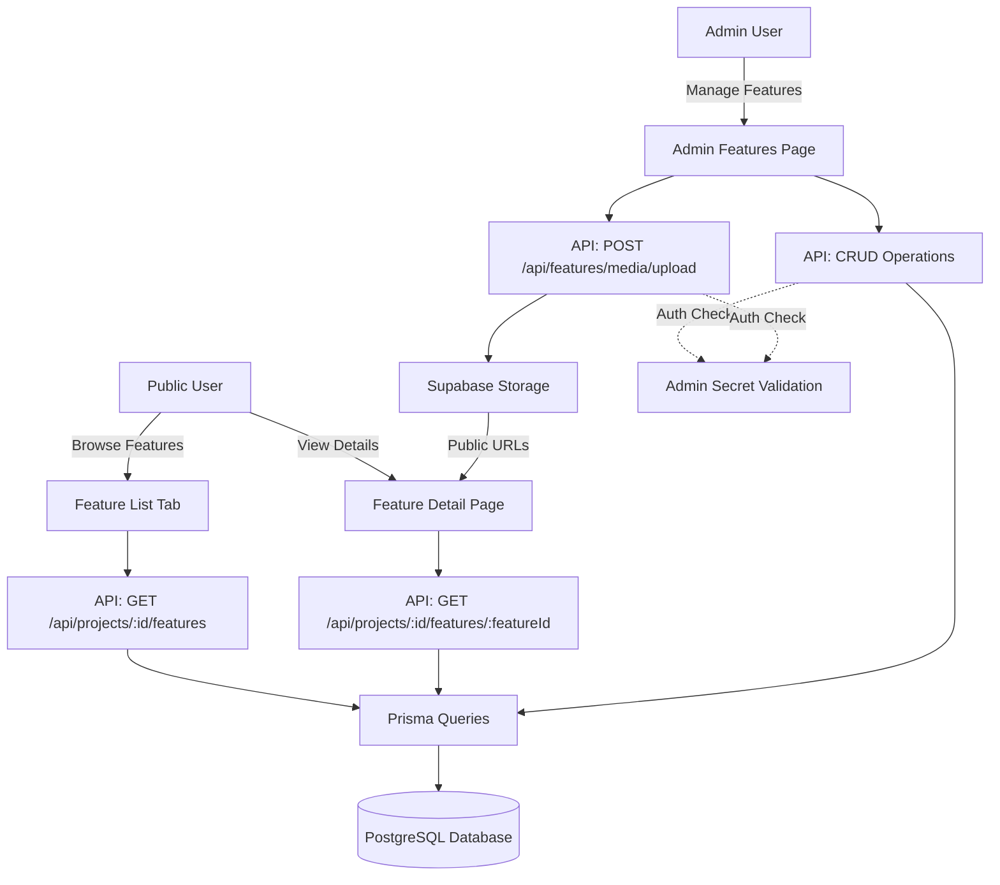
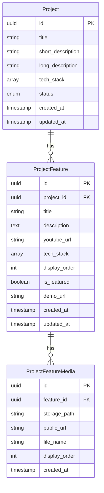

# Design Document: Project Features Showcase

## Overview

The Project Features Showcase system extends the existing portfolio application to enable detailed feature presentations within projects. The system follows a three-tier architecture:

1. **Data Layer**: Prisma-based database access with two new tables (`project_features` and `project_feature_media`)
2. **API Layer**: RESTful Next.js App Router API routes following existing project patterns
3. **UI Layer**: React Server Components and Client Components for admin and public interfaces

The design integrates seamlessly with existing systems:
- Extends the Prisma schema with new models
- Reuses Supabase Storage patterns from `project_media`
- Follows authentication patterns from existing admin interfaces
- Integrates with existing `ProjectDetailTabs` component for public display
- Uses established markdown rendering with `react-markdown`, `remarkGfm`, and `rehypeHighlight`

## Architecture

### High-Level Architecture



### Database Schema



## Components and Interfaces

### Database Layer

#### Prisma Schema Extensions

Add two new models to `prisma/schema.prisma`:

```prisma
model ProjectFeature {
  id            String   @id @default(dbgenerated("gen_random_uuid()::text"))
  project_id    String
  title         String   @db.VarChar(200)
  description   String?  @db.Text
  youtube_url   String?  @db.VarChar(2048)
  tech_stack    String[] @default([])
  display_order Int      @default(0)
  is_featured   Boolean  @default(false)
  demo_url      String?  @db.VarChar(2048)
  created_at    DateTime @default(now())
  updated_at    DateTime @updatedAt

  project       Project               @relation(fields: [project_id], references: [id], onDelete: Cascade)
  media         ProjectFeatureMedia[]

  @@index([project_id, display_order])
  @@map("project_features")
}

model ProjectFeatureMedia {
  id            String   @id @default(dbgenerated("gen_random_uuid()::text"))
  feature_id    String
  storage_path  String   @db.VarChar(1024)
  public_url    String   @db.VarChar(2048)
  file_name     String   @db.VarChar(255)
  display_order Int      @default(0)
  created_at    DateTime @default(now())

  feature       ProjectFeature @relation(fields: [feature_id], references: [id], onDelete: Cascade)

  @@index([feature_id, display_order])
  @@map("project_feature_media")
}
```

Update the `Project` model to include the relationship:

```prisma
model Project {
  // ... existing fields
  
  timeline_entries  TimelineEntry[]
  project_media     ProjectMedia[]
  features          ProjectFeature[]  // Add this line
  
  // ... rest of model
}
```

#### Query Functions

Create `lib/supabase/queries/features.ts` following the pattern from `projects.ts`:

```typescript
// GET operations
export async function getFeaturesByProjectId(projectId: string)
export async function getFeatureById(featureId: string)

// CRUD operations
export async function createFeature(data: Prisma.ProjectFeatureCreateInput)
export async function updateFeature(id: string, data: Prisma.ProjectFeatureUpdateInput)
export async function deleteFeature(id: string)
export async function updateFeatureDisplayOrder(updates: Array<{ id: string; display_order: number }>)

// Media operations
export async function getFeatureMedia(featureId: string)
export async function createFeatureMedia(data: Prisma.ProjectFeatureMediaCreateInput)
export async function deleteFeatureMedia(id: string)
```

### API Layer

#### Feature CRUD API Routes

**GET /api/projects/[id]/features**
- Public endpoint
- Returns all features for a project, ordered by `display_order` ascending
- Includes first media thumbnail for each feature

**GET /api/projects/[id]/features/[featureId]**
- Public endpoint
- Returns single feature with all associated media
- Media ordered by `display_order` ascending
- Returns 404 if feature doesn't exist or doesn't belong to the project

**POST /api/projects/[id]/features**
- Admin-only (requires secret validation)
- Creates a new feature
- Validates all inputs per requirements
- Returns created feature with 201 status

**PUT /api/projects/[id]/features/[featureId]**
- Admin-only (requires secret validation)
- Updates an existing feature
- Validates updated fields
- Returns updated feature

**DELETE /api/projects/[id]/features/[featureId]**
- Admin-only (requires secret validation)
- Deletes feature and cascades to media records
- Triggers storage cleanup for associated media files

**PATCH /api/projects/[id]/features/reorder**
- Admin-only (requires secret validation)
- Bulk updates `display_order` values
- Accepts array of `{ id, display_order }` objects
- Returns success status

#### Feature Media Upload API Route

**POST /api/features/media/upload**
- Admin-only (requires secret validation)
- FormData fields: `file`, `feature_id`, `secret`
- Validates file type (JPEG, PNG, GIF, WebP) and size (≤10MB)
- Stores in Supabase Storage at `feature-media/{feature_id}/{filename}`
- Creates database record with storage path and public URL
- Returns created media record with 201 status

**DELETE /api/features/media/[id]**
- Admin-only (requires secret validation)
- Deletes media file from Supabase Storage
- Deletes database record
- Returns success status

### UI Layer

#### Admin Interface

**Page: `/app/admin/projects/[id]/features/page.tsx`**
- Server Component
- Validates admin secret (query parameter)
- Fetches all features for the project
- Renders `AdminFeaturesManagement` client component

**Component: `features/admin/components/AdminFeaturesManagement.tsx`**
- Client Component with drag-and-drop state management
- Features:
  - List of features with drag handles
  - Inline editing form for each feature
  - "Add New Feature" button
  - Markdown editor with live preview
  - Media upload panel (max 20 images, 10MB each)
  - Media thumbnails (150x150px) with delete buttons
  - Delete feature button with confirmation dialog
  - Display order management via drag-and-drop

**Component: `features/admin/components/FeatureForm.tsx`**
- Client Component for feature editing
- Fields:
  - Title (required, max 200 chars) - text input
  - Description (optional, max 50000 chars) - markdown editor
  - YouTube URL (optional, max 2048 chars) - text input with validation
  - Tech Stack (optional, max 50 items) - tag input
  - Demo URL (optional, max 2048 chars) - text input with validation
  - Is Featured (boolean) - checkbox
- Client-side validation before submission
- Error message display per field

**Component: `features/admin/components/FeatureMediaUpload.tsx`**
- Client Component for multi-image upload
- Drag-and-drop file upload or click to browse
- Preview thumbnails (150x150px) with delete buttons
- Reorder thumbnails via drag-and-drop
- Upload progress indicators
- Validation feedback (file type, size, count)

#### Public Interface

**Tab Integration: Update `features/projects/components/dynamic/ProjectDetailTabs.tsx`**
- Add "Features" tab to existing tabs
- Client Component with tab state management
- Tab shows feature count badge if features exist
- Renders `FeaturesTabContent` when selected

**Component: `features/features/components/FeaturesTabContent.tsx`**
- Client Component
- Responsive grid layout:
  - Mobile: 1 column
  - Tablet: 2 columns
  - Desktop: 3 columns
- Renders feature cards ordered by `display_order`
- Shows empty state message if no features

**Component: `features/features/components/FeatureCard.tsx`**
- Clickable card component
- Content:
  - Thumbnail image (first media by display_order, or placeholder)
  - Title
  - Description excerpt (first 150 chars + ellipsis)
- Navigates to feature detail page on click

**Page: `/app/projects/[id]/features/[featureId]/page.tsx`**
- Server Component
- Fetches feature and validates project ownership
- Returns 404 if not found or mismatched project
- Renders feature detail layout

**Component: `features/features/components/FeatureDetail.tsx`**
- Server Component
- Sections:
  - Feature title (h1)
  - Media gallery (if images exist)
  - YouTube embed (if youtube_url exists)
  - Description (markdown with syntax highlighting)
  - Tech stack badges
  - Demo link button (if demo_url exists)
  - "Back to Project" button

**Component: `features/features/components/FeatureMediaGallery.tsx`**
- Client Component with image navigation state
- Displays images ordered by `display_order`
- Features:
  - Large image display
  - Previous/Next navigation buttons
  - Thumbnail strip below main image
  - Click thumbnail to jump to that image
  - Keyboard navigation (arrow keys)

**Component: `features/features/components/YouTubeEmbed.tsx`**
- Client Component for iframe embed
- Props: `url` (string)
- Responsive iframe (width: 100%, aspect ratio: 16:9)
- Standard YouTube player controls enabled
- Error boundary for failed loads

## Data Models

### TypeScript Types

Add to `features/projects/types.ts`:

```typescript
export interface ProjectFeature {
  id: string;
  project_id: string;
  title: string;
  description?: string;
  youtube_url?: string;
  tech_stack: string[];
  display_order: number;
  is_featured: boolean;
  demo_url?: string;
  created_at: string;
  updated_at: string;
  media?: ProjectFeatureMedia[];  // Optional, populated in queries
  thumbnail?: ProjectFeatureMedia;  // Optional, first media for cards
}

export interface ProjectFeatureMedia {
  id: string;
  feature_id: string;
  storage_path: string;
  public_url: string;
  file_name: string;
  display_order: number;
  created_at: string;
}

export type CreateFeatureInput = Omit<
  ProjectFeature,
  'id' | 'created_at' | 'updated_at' | 'media' | 'thumbnail'
>;

export type UpdateFeatureInput = Partial<CreateFeatureInput>;

export interface FeatureValidationResult {
  valid: boolean;
  errors: Record<string, string>;  // field -> error message
}
```

### Validation Schema

Create `features/features/utils/validation.ts`:

```typescript
export function validateFeatureInput(data: unknown): FeatureValidationResult {
  const errors: Record<string, string> = {};
  
  // Title validation
  if (!data.title || data.title.trim() === '') {
    errors.title = 'Title is required';
  } else if (data.title.length > 200) {
    errors.title = 'Title must not exceed 200 characters';
  }
  
  // Description validation
  if (data.description && data.description.length > 50000) {
    errors.description = 'Description must not exceed 50000 characters';
  }
  
  // YouTube URL validation
  if (data.youtube_url) {
    const youtubePattern = /^https:\/\/(www\.youtube\.com\/watch\?v=|youtu\.be\/).+$/;
    if (!youtubePattern.test(data.youtube_url)) {
      errors.youtube_url = 'Invalid YouTube URL format';
    } else if (data.youtube_url.length > 2048) {
      errors.youtube_url = 'YouTube URL must not exceed 2048 characters';
    }
  }
  
  // Demo URL validation
  if (data.demo_url) {
    if (!/^https?:\/\/.+$/.test(data.demo_url)) {
      errors.demo_url = 'Demo URL must start with http:// or https://';
    } else if (data.demo_url.length > 2048) {
      errors.demo_url = 'Demo URL must not exceed 2048 characters';
    }
  }
  
  // Tech stack validation
  if (data.tech_stack && data.tech_stack.length > 50) {
    errors.tech_stack = 'Tech stack must not exceed 50 items';
  }
  
  return {
    valid: Object.keys(errors).length === 0,
    errors
  };
}

export function validateMediaFile(mimeType: string, size: number): string | null {
  const allowedTypes = ['image/jpeg', 'image/png', 'image/gif', 'image/webp'];
  
  if (!allowedTypes.includes(mimeType)) {
    return 'Unsupported file format. Please upload JPEG, PNG, GIF, or WebP';
  }
  
  const maxSize = 10 * 1024 * 1024; // 10 MB
  if (size > maxSize) {
    return 'File size exceeds 10 MB limit';
  }
  
  return null;
}
```

### Storage Path Construction

Create `features/features/utils/storage.ts`:

```typescript
export function buildFeatureMediaPath(featureId: string, filename: string): string {
  // Sanitize filename to prevent path traversal
  const sanitized = filename.replace(/[^a-zA-Z0-9._-]/g, '_');
  return `feature-media/${featureId}/${sanitized}`;
}

export function getFeatureMediaBucket(): string {
  return 'public'; // Use public bucket for feature media
}
```

## Correctness Properties

*A property is a characteristic or behavior that should hold true across all valid executions of a system—essentially, a formal statement about what the system should do. Properties serve as the bridge between human-readable specifications and machine-verifiable correctness guarantees.*

#### Property Reflection

Before defining properties, let's identify and eliminate redundancy:

**Identified Properties from Prework:**
1. Title validation (empty, length)
2. Description length validation
3. YouTube URL format validation
4. Demo URL protocol validation
5. Feature create round-trip
6. Feature update field preservation
7. Feature ordering by display_order
8. Feature media ordering by display_order
9. Storage path construction
10. File type validation
11. Upload round-trip (create media record)
12. Public URL generation
13. Feature display order renumbering
14. Serialization round-trip (parse-format-parse)

**Redundancy Analysis:**
- Properties 7 and 8 (ordering) can be combined into a single comprehensive ordering property that applies to both features and media
- Property 5 (create round-trip) and Property 14 (serialization round-trip) both test data preservation but at different layers - both are valuable
- Properties 1-4 are all input validation but test different fields - all are valuable
- Property 11 (upload round-trip) and 12 (URL generation) are related but test different aspects - both valuable

**Consolidated Property Set:**
All properties provide unique validation value and should be retained.

### Property 1: Title Validation

*For any* title input, the validation function SHALL reject empty strings and strings exceeding 200 characters, and SHALL accept non-empty strings of 200 characters or less.

**Validates: Requirements 2.1, 2.8**

### Property 2: Description Length Validation

*For any* description input, the validation function SHALL reject strings exceeding 50000 characters and SHALL accept strings of 50000 characters or less (including empty strings).

**Validates: Requirements 2.2, 2.8, 7.5**

### Property 3: YouTube URL Format Validation

*For any* URL input, the validation function SHALL accept URLs matching the pattern `https://www.youtube.com/watch?v=*` or `https://youtu.be/*` and SHALL reject all other URL formats.

**Validates: Requirements 2.3, 8.1, 8.3**

### Property 4: Demo URL Protocol Validation

*For any* URL input, the validation function SHALL accept URLs starting with `http://` or `https://` and SHALL reject URLs with other protocols or no protocol.

**Validates: Requirements 2.4, 2.8**

### Property 5: Feature Creation Round-Trip

*For any* valid feature data object (satisfying all validation rules), creating the feature then retrieving it by ID SHALL return an equivalent object with matching values for title, description, youtube_url, tech_stack, demo_url, and is_featured.

**Validates: Requirements 2.5, 12.4**

### Property 6: Feature Update Field Isolation

*For any* existing feature and any valid update data, updating the feature SHALL modify only the specified fields in the update data and SHALL preserve all other fields unchanged.

**Validates: Requirements 2.7**

### Property 7: Display Order Preservation

*For any* set of features or media records, querying by parent ID SHALL return results ordered by display_order in ascending order (lowest display_order first).

**Validates: Requirements 2.11, 2.13, 4.2, 5.8, 6.3, 9.6**

### Property 8: Storage Path Construction

*For any* feature ID and filename, the storage path construction function SHALL produce a path in the format `feature-media/{featureId}/{sanitized_filename}` where sanitized_filename contains only alphanumeric characters, dots, underscores, and hyphens.

**Validates: Requirements 3.1**

### Property 9: Media File Type Validation

*For any* file MIME type, the validation function SHALL accept only `image/jpeg`, `image/png`, `image/gif`, and `image/webp` and SHALL reject all other MIME types.

**Validates: Requirements 3.3**

### Property 10: Media Upload Round-Trip

*For any* valid image file upload, the upload operation SHALL create a database record where the storage_path, public_url, and file_name fields match the uploaded file's properties.

**Validates: Requirements 3.4, 3.8**

### Property 11: Display Order Renumbering

*For any* list of features with arbitrary display_order values, after reordering to a new sequence, the display_order values SHALL be renumbered sequentially starting from 1 with increments of 1.

**Validates: Requirements 4.9, 9.1**

### Property 12: Feature Card Rendering

*For any* feature with description text, the rendered feature card SHALL display a title and a description excerpt truncated to exactly 150 characters (if description exceeds 150 characters) followed by an ellipsis.

**Validates: Requirements 5.3**

### Property 13: Tech Stack Badge Rendering

*For any* tech_stack array, the detail page SHALL render exactly one badge element for each technology in the array, preserving the order.

**Validates: Requirements 6.6**

### Property 14: YouTube URL Storage Preservation

*For any* valid YouTube URL, storing then retrieving the feature SHALL return the exact same URL value without modification or extraction.

**Validates: Requirements 8.2**

### Property 15: Data Serialization Round-Trip

*For any* valid feature data object, parsing then formatting then parsing SHALL produce an equivalent object with all fields matching the original.

**Validates: Requirements 12.4**

## Error Handling

### API Error Responses

All API routes follow a consistent error response format:

```typescript
{
  error: string;           // Human-readable error message
  details?: Record<string, string>;  // Optional field-specific errors for validation
}
```

**HTTP Status Codes:**
- `400 Bad Request`: Validation errors, malformed requests
- `401 Unauthorized`: Missing or invalid admin secret
- `404 Not Found`: Resource doesn't exist
- `409 Conflict`: Unique constraint violations
- `500 Internal Server Error`: Database errors, storage errors, unexpected failures

### Validation Error Handling

Client-side validation happens before submission to provide immediate feedback:
- Display field-specific error messages inline
- Disable submit button until all validations pass
- Preserve form data on validation failure

Server-side validation provides defense in depth:
- Validate all inputs even if client validation passed
- Return 400 with detailed field errors
- Client retains form data and displays server errors

### Storage Error Handling

**Upload Failures:**
- If Supabase Storage upload fails, return 500 with retry message
- Do not create database record if storage upload fails
- Client shows error and allows retry

**Delete Failures:**
- If storage delete fails during media deletion, log error but proceed with database deletion
- If storage delete fails during feature CASCADE delete, log error but complete cascade
- Orphaned files in storage are acceptable (can be cleaned up separately)

### Database Error Handling

**Connection Failures:**
- Return 500 with generic error message
- Log full error details server-side
- Client allows retry

**Constraint Violations:**
- Foreign key violations during manual queries return 400
- CASCADE deletes handle referential integrity automatically

**Transaction Failures:**
- Display order updates use transactions
- On failure, rollback and return 500
- Client reverts UI to previous state

### Component Error Boundaries

**Markdown Rendering:**
- Wrap `MarkdownContent` in error boundary
- On parsing failure, render raw text as fallback
- Log error for debugging

**YouTube Embed:**
- iframe onerror handler displays "Video unavailable" message
- Preserve layout structure even when video fails
- Allow user to continue viewing other content

**Image Loading:**
- img onerror handler displays placeholder image
- Preserve card/gallery structure
- Log failed URL for debugging

## Testing Strategy

### Overview

The testing strategy combines property-based testing (PBT) for universal properties and example-based unit tests for specific scenarios. This dual approach ensures comprehensive coverage:
- **Property tests** verify correctness across randomized inputs using a PBT library
- **Unit tests** verify specific examples, edge cases, and integration points
- **Integration tests** verify external service interactions (database, storage, authentication)

### Property-Based Testing Configuration

**Library Selection:**
- Use `fast-check` (JavaScript/TypeScript property-based testing library)
- Install: `npm install --save-dev fast-check @types/fast-check`

**Test Configuration:**
- Minimum **100 iterations** per property test (due to randomization)
- Each property test references its design property number
- Tag format: `// Feature: project-features-showcase, Property {number}: {property_text}`

**Generator Requirements:**
Property tests require custom generators for domain types:
- Valid titles (non-empty, ≤200 chars)
- Valid descriptions (≤50000 chars)
- Valid YouTube URLs (matching pattern)
- Valid demo URLs (http/https protocol)
- Valid filenames (alphanumeric, dots, dashes, underscores)
- Valid MIME types (jpeg, png, gif, webp)
- Invalid variants of all above (for negative testing)

### Unit Testing

**Validation Tests** (`features/features/utils/validation.test.ts`):
- Test `validateFeatureInput` with specific valid examples
- Test error cases: empty title, title too long, description too long
- Test URL validation: valid YouTube URLs, invalid formats, missing protocol
- Test tech_stack limit (exactly 50, 51 items)

**Storage Path Tests** (`features/features/utils/storage.test.ts`):
- Test `buildFeatureMediaPath` with normal filenames
- Test filename sanitization: spaces, special characters, path traversal attempts
- Verify bucket name constant

**Query Function Tests** (`lib/supabase/queries/features.test.ts`):
- Test CRUD operations with example data
- Test ordering behavior with specific display_order values
- Test cascade deletes with example feature and media
- Test error cases: non-existent IDs, foreign key violations

**API Route Tests** (`app/api/projects/[id]/features/route.test.ts`):
- Test authentication: valid secret, invalid secret, missing secret
- Test GET with empty result, GET with multiple features
- Test POST with valid data, POST with invalid data (400)
- Test PUT with partial updates, PUT non-existent (404)
- Test DELETE success, DELETE non-existent (404)
- Test PATCH reorder with specific sequences

**Component Tests**:
- Test `FeatureCard` rendering with example data
- Test empty states: no features, no images, no description
- Test conditional rendering: with/without YouTube URL, with/without demo URL
- Test navigation: card click, back button

### Integration Testing

**Database Integration**:
- Test Prisma schema migrations apply successfully
- Test foreign key CASCADE delete behavior
- Test transaction rollback on failure
- Use test database instance

**Supabase Storage Integration**:
- Test upload success and failure scenarios
- Test public URL generation and accessibility
- Test delete cleanup
- Use test storage bucket

**Authentication Integration**:
- Test admin secret validation against environment variable
- Test auth middleware runs before data access
- Test unauthorized access returns 403 without data leakage

**Markdown Rendering Integration**:
- Test react-markdown renders various markdown elements
- Test syntax highlighting applies to code blocks
- Test HTML sanitization prevents XSS
- Test error handling for malformed markdown

### End-to-End Testing

**Feature Management Flow**:
1. Admin creates project
2. Admin creates feature with title and description
3. Admin uploads media files
4. Admin reorders features
5. Admin updates feature
6. Verify public page displays correctly
7. Admin deletes feature
8. Verify public page updates

**Public Viewing Flow**:
1. User navigates to project detail page
2. User clicks Features tab
3. User sees feature cards
4. User clicks feature card
5. User views feature detail with media gallery
6. User navigates back to project

### Test Organization

```
tests/
├── unit/
│   ├── validation.test.ts
│   ├── storage.test.ts
│   └── queries/
│       └── features.test.ts
├── integration/
│   ├── api/
│   │   └── features.test.ts
│   ├── database/
│   │   └── schema.test.ts
│   └── storage/
│       └── upload.test.ts
├── property/
│   ├── validation.property.test.ts
│   ├── ordering.property.test.ts
│   ├── storage-path.property.test.ts
│   └── serialization.property.test.ts
└── e2e/
    ├── admin-feature-management.spec.ts
    └── public-feature-viewing.spec.ts
```

### Example Property Test

```typescript
// features/features/utils/validation.property.test.ts

import fc from 'fast-check';
import { validateFeatureInput } from './validation';

describe('Feature Validation Properties', () => {
  // Feature: project-features-showcase, Property 1: Title Validation
  it('should reject empty titles and titles exceeding 200 characters', () => {
    fc.assert(
      fc.property(
        fc.oneof(
          fc.constant(''),                    // empty
          fc.constant('   '),                 // whitespace
          fc.string({ minLength: 201 })       // too long
        ),
        (invalidTitle) => {
          const result = validateFeatureInput({ title: invalidTitle });
          expect(result.valid).toBe(false);
          expect(result.errors.title).toBeDefined();
        }
      ),
      { numRuns: 100 }
    );
  });

  it('should accept non-empty titles of 200 characters or less', () => {
    fc.assert(
      fc.property(
        fc.string({ minLength: 1, maxLength: 200 }).filter(s => s.trim().length > 0),
        (validTitle) => {
          const result = validateFeatureInput({ title: validTitle });
          expect(result.errors.title).toBeUndefined();
        }
      ),
      { numRuns: 100 }
    );
  });

  // Feature: project-features-showcase, Property 3: YouTube URL Format Validation
  it('should accept valid YouTube URLs and reject invalid formats', () => {
    const validPatterns = [
      'https://www.youtube.com/watch?v=dQw4w9WgXcQ',
      'https://youtu.be/dQw4w9WgXcQ'
    ];
    
    const invalidPatterns = [
      'http://www.youtube.com/watch?v=abc',  // http not https
      'https://vimeo.com/123456',            // wrong domain
      'https://youtube.com/watch?v=abc',     // missing www
      'not a url',
      ''
    ];

    validPatterns.forEach(url => {
      const result = validateFeatureInput({ title: 'Test', youtube_url: url });
      expect(result.errors.youtube_url).toBeUndefined();
    });

    invalidPatterns.forEach(url => {
      const result = validateFeatureInput({ title: 'Test', youtube_url: url });
      expect(result.valid).toBe(false);
      expect(result.errors.youtube_url).toBeDefined();
    });
  });
});
```

### Coverage Goals

- **Unit Test Coverage**: ≥90% for utility functions and query functions
- **Integration Test Coverage**: All API routes, all database operations
- **Property Test Coverage**: All 15 correctness properties
- **E2E Test Coverage**: Core user flows (admin management, public viewing)

### Continuous Integration

- Run all unit and property tests on every commit
- Run integration tests on pull requests
- Run E2E tests nightly and before releases
- Property tests configured with fixed seed for reproducibility
- Failed property tests output minimal failing example for debugging
